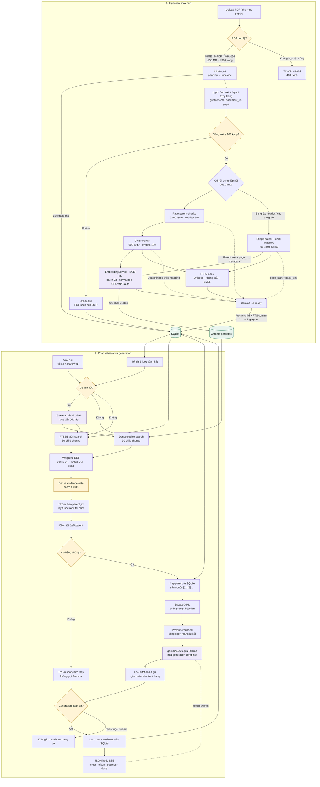

# Simple Local RAG + Daily Trading Digest

Ứng dụng RAG hỏi đáp PDF và daily trading digest chạy local: Web UI, REST API,
streaming SSE, metadata filter và citation theo trang hoặc mã/ngày/section. PDF,
digest, câu hỏi, embedding và câu trả lời không được gửi tới dịch vụ cloud.

Stack mặc định:

- `BAAI/bge-m3`: normalized dense embedding local, chỉ đọc từ Hugging Face cache.
- `gemma4:e2b`: sinh câu trả lời bằng Ollama tại `127.0.0.1:11434`.
- Chroma: vector index bền vững trên ổ đĩa.
- SQLite + FTS5/BM25: metadata, child text, lexical index, job và lịch sử chat.
- FastAPI + HTML/CSS/JavaScript thuần; không dùng CDN hoặc Node.

## Kiến trúc



Page parent/child thông thường không vượt ranh giới trang. Khi phát hiện câu đang
dang dở hoặc header bảng lặp ở trang kế tiếp, ingestion bổ sung một bridge parent
tối đa 2.400 ký tự, một boundary child nhìn thấy cả hai phía và các context child
phủ toàn parent; mỗi child tối đa 600 ký tự. Nhờ đó truy vấn khớp phần dẫn ở trang
trước vẫn nạp được toàn bộ phần tiếp nối ở trang sau. Nguồn bridge được citation
theo khoảng như `trang 3–4`; chunk một trang vẫn giữ API `page` cũ. ID tài
liệu/chunk được tạo xác định từ SHA-256, số trang và vị trí chunk; retry không tạo
bản trùng. Lexical retrieval chỉ rerank parent đã vượt dense threshold, nên exact
match không thể tự đưa một nguồn semantic yếu vào prompt.

## 1. Yêu cầu hệ thống

- macOS/Linux, khuyến nghị RAM 16 GB.
- Python 3.11–3.13.
- Ollama.
- Khoảng 12–15 GB trống cho Gemma 4, BGE-M3 và index.

Trên macOS có thể cài bằng Homebrew:

```bash
brew install python@3.13 ollama
brew services start ollama
```

## 2. Tạo môi trường và cài dependency

```bash
cd /Users/thachtan/Documents/source/APG/SimpleRAGChatBot
python3 -m venv .venv
source .venv/bin/activate
python -m pip install --upgrade pip
python -m pip install ".[test]"
```

Project không dùng `langchain-community`, FAISS, `unstructured`, OpenAI API hay
LangSmith tracing.

## 3. Tải model một lần khi có Internet

Tải Gemma 4 vào Ollama:

```bash
ollama pull gemma4:e2b
ollama run gemma4:e2b "Trả lời đúng một từ: OK"
```

Tải BGE-M3 vào Hugging Face cache:

```bash
HF_HUB_OFFLINE=0 TRANSFORMERS_OFFLINE=0 python -c \
  'from sentence_transformers import SentenceTransformer; SentenceTransformer("BAAI/bge-m3"); print("BGE-M3 ready")'
```

Cảnh báo về request chưa xác thực tới Hugging Face ở bước này chỉ liên quan đến
việc tải model public; PDF không được upload. Khi ứng dụng chạy, các biến
`HF_HUB_OFFLINE=1`, `TRANSFORMERS_OFFLINE=1`, `HF_HUB_DISABLE_TELEMETRY=1` và
`LANGSMITH_TRACING=false` được bật mặc định.

## 4. Chạy Web UI và API

```bash
brew services start ollama
source .venv/bin/activate
python chatbot.py serve
```

Mở <http://127.0.0.1:8000>. Server chỉ bind `127.0.0.1`. API upload/chat local
giữ tương thích cũ; API ingest digest nội bộ luôn yêu cầu Bearer token qua
`RAG_SERVICE_API_KEY`. Không bind dịch vụ ra Internet.

### Chạy cùng GX Portfolio Intelligence bằng Docker

Docker image vẫn chạy embedding hoàn toàn offline. Vì vậy phải tải BGE-M3 vào
named volume một lần trước khi khởi động service. Từ thư mục
`gx.portfolio.intelligence`, với `RAG_SERVICE_API_KEY` đã được đặt trong
deployment `.env`, chạy:

```bash
docker compose --profile service build simple-rag
docker compose --profile service run --rm \
  -e HF_HUB_OFFLINE=0 -e TRANSFORMERS_OFFLINE=0 \
  simple-rag python -c \
  'from sentence_transformers import SentenceTransformer; SentenceTransformer("BAAI/bge-m3"); print("BGE-M3 ready")'
docker compose --profile service up -d --build
```

Ollama mặc định chạy trên host và container truy cập qua
`http://host.docker.internal:11434`. Trước khi bật stack, chạy
`ollama pull gemma4:e2b` và xác nhận Ollama cho phép kết nối từ Docker; trên
Linux có thể cần cấu hình Ollama lắng nghe trên host gateway. Có thể đổi URL
bằng `SIMPLE_RAG_OLLAMA_BASE_URL` và model bằng `RAG_CHAT_MODEL`.

Compose giữ SQLite/Chroma trong volume `simple_rag_data` và Hugging Face cache
trong `simple_rag_models`. Cổng UI/API chỉ được publish tại
`127.0.0.1:8000`; `0.0.0.0` chỉ được chọn rõ ràng bên trong container để service
GX truy cập qua URL nội bộ `http://simple-rag:8000`. Không publish cổng này trên
interface công cộng.

Lần khởi động đầu tiên, các PDF có sẵn trong `papers/` được copy và đưa vào hàng
đợi một cách idempotent. UI tự cập nhật trạng thái:

```text
pending -> indexing -> ready
                     -> failed
```

PDF có dưới 100 ký tự text được đánh dấu `failed` vì bản này chưa có OCR.

Kiểm tra sức khỏe:

```bash
curl http://127.0.0.1:8000/api/health
```

Health response hiển thị thêm `fts`, `fts_indexed_children`, embedding device,
dimension, revision, số input từng bị tokenizer cắt và
`full_report_payloads`. `status=degraded` thường có nghĩa Ollama chưa chạy,
thiếu `gemma4:e2b`, một index local không sẵn sàng, hoặc report `ready` đang
thiếu canonical payload/chunk decision đúng version.

## 5. CLI

`chatbot.py` vẫn tương thích cách chạy cũ:

```bash
python chatbot.py
```

Trong CLI, dùng `/new` để tạo phiên mới và `/quit` để thoát.

Import/index một file hoặc cả thư mục rồi chờ job hoàn tất:

```bash
python chatbot.py ingest papers
python chatbot.py ingest /duong/dan/tai_lieu.pdf
```

Ép tạo lại parent/child, Chroma và FTS cho toàn bộ PDF đã upload, kể cả khi
fingerprint không đổi. Hãy dừng Web/CLI đang chạy trước khi gọi lệnh này:

```bash
python chatbot.py reindex
```

Lệnh giữ nguyên PDF và hội thoại trong SQLite, chỉ xóa dữ liệu index dẫn xuất rồi
đưa tài liệu về `pending → indexing → ready`. Kết quả thành công có dạng:

```text
Đã reindex 3/3 tài liệu; failed=0; skipped=0.
```

`failed` là PDF được chạy lại nhưng indexing thất bại; `skipped` là tài liệu đang
ở trạng thái xóa hoặc không còn file gốc trong `data/uploads/`.

Backfill canonical Full Analysis cũ hoàn toàn từ SQLite, không khởi tạo Ollama,
embedding, Chroma client hay gọi LLM. Dừng mọi writer trước khi chạy:

```bash
local-rag backfill-full-reports --dry-run
local-rag backfill-full-reports --apply
```

Kết quả JSON luôn có `scanned/stored/partial/requeued/failed`. Ở `--dry-run`,
`stored` và `requeued` là số row sẽ thay đổi; không có write. Sau `--apply`, chỉ
mở lại GX PI khi `failed=0`, rồi chờ các document `requeued` trở lại `ready`.
Chạy lại sau khi indexing xong là no-op (`stored=0`, `requeued=0`).

Chạy bộ eval 30 câu local, gồm 10 câu khó về mã, số, thuật ngữ và Việt–Anh:

```bash
python chatbot.py evaluate evals/questions.jsonl
```

Để nghiệm thu hybrid trước khi bật mặc định:

```bash
RAG_HYBRID_SEARCH=1 python chatbot.py evaluate evals/questions.jsonl
```

Eval báo `parent_recall_at_5`, citation đúng trang, abstention, số citation không
liên quan và so sánh dense/hybrid trên nhóm exact-keyword. Phần
`hybrid_comparison` ghi Recall@5, P95 latency, tỷ lệ latency và recommendation
bật hybrid mặc định; `chat_mode` cho biết phần answer/citation đang dùng dense hay
hybrid. Ngưỡng nghiệm thu được ghi ngay trong kết quả JSON.
Bản baseline đã chạy trên toàn bộ hai PDF mẫu nằm tại `evals/baseline.json`;
ground truth trang tương ứng nằm trong `evals/questions.jsonl`. Kết quả benchmark
retrieval-only giúp quyết định bật hybrid nằm tại `evals/hybrid_retrieval.json`.

## REST API

| Method | Endpoint | Mục đích |
| --- | --- | --- |
| `GET` | `/api/health` | SQLite/FTS, Chroma, Ollama và trạng thái embedding |
| `GET` | `/api/documents` | Danh sách tài liệu/job |
| `GET` | `/api/documents?page=1&page_size=50` | Catalog phân trang cho UI |
| `GET` | `/api/digest-batches/latest` | Batch digest mới nhất cho UI |
| `POST` | `/api/documents` | Upload multipart PDF; trả `202` |
| `GET` | `/api/documents/{id}` | Xem trạng thái một tài liệu |
| `GET` | `/api/documents/{id}/full-report` | Đọc canonical `full_report_v1` và typed decision |
| `DELETE` | `/api/documents/{id}` | Xóa vector, metadata và file; `204` |
| `POST` | `/api/chat` | Trả JSON hoàn chỉnh |
| `POST` | `/api/chat/stream` | Trả SSE `meta`, `token`, `sources`, `done`, `error` |
| `GET` | `/api/sessions/{id}/messages` | Đọc lịch sử local |
| `DELETE` | `/api/sessions/{id}` | Xóa một hội thoại |

### Daily digest API nội bộ

Các endpoint sau bắt buộc header `Authorization: Bearer $RAG_SERVICE_API_KEY`:

| Method | Endpoint | Mục đích |
| --- | --- | --- |
| `PUT` | `/internal/v1/digest-batches/{batch_id}` | Tạo batch idempotent |
| `POST` | `/internal/v1/digest-batches/{batch_id}/documents:batch` | Nhận tối đa 50 digest đã sanitize |
| `POST` | `/internal/v1/digest-batches/{batch_id}/documents:promote` | Promote tối đa 50 digest đã seal sang Full Analysis |
| `POST` | `/internal/v1/digest-batches/{batch_id}:seal` | Seal khi đủ target và rank/ticker duy nhất |
| `GET` | `/internal/v1/digest-batches/{batch_id}` | Đọc counts và item status phân trang để reconcile |
| `GET` | `/internal/v1/digest-batches/{batch_id}/documents/{ticker}/full-report` | Đọc report/decision đã verify hash |

Mỗi digest có logical identity `(source, ticker, analysis_date, cutoff)`, đúng 9
section và tối đa 256 KiB nội dung canonical. Cùng identity/hash là no-op; bản
cập nhật cũ hơn bị trả `stale`; bản mới hơn thay toàn bộ chunks/vectors. Chỉ
digest và opaque evidence ID/fingerprint được lưu. Các trường raw như title,
excerpt, body, author hoặc prompt bị schema từ chối. Digest được chunk độc lập
theo section, không overlap sang section kế tiếp.

Daily producer nên gửi thêm `identity_hash` và `digest_hash` SHA-256. Sau khi
batch đã seal, endpoint `documents:promote` nhận contract v2
`content_kind=report_schema=full_report_v1`: đúng 7 stage và đúng 12 section
`{status,text}`. Promotion chỉ thay nội dung của logical document hiện hữu,
giữ nguyên document ID; `parent_identity_hash` và `expected_digest_hash` phải
khớp daily digest đang lưu, còn watermark phải mới hơn. SQLite thay sections và
ghi canonical envelope, typed decision, 12 sections và vector-deletion outbox
trong cùng transaction; worker thay Chroma theo cơ chế retry. Canonical envelope
được hash SHA-256 và có thể đọc lại lossless qua API. Chỉ projection JSON được
index thêm dưới section `decision.structured` (`report_stage=risk`); toàn blob
report không được embed. Replay đúng Full Analysis là no-op/recovery, còn
downgrade hoặc một full generation khác bị từ chối. Raw evidence, `session.json`,
absolute path, tool call, credential và prompt input vẫn không thuộc contract
nên không được ghi vào SQLite, Chroma, artifact hoặc structured log.
Full Analysis có thể chứa khuyến nghị, sizing, giá mục tiêu và quyết định danh
mục để truy xuất thông tin. Đây không phải lệnh đã được đặt; SimpleRAG không có
API đặt lệnh hoặc tự động tái cấu trúc danh mục.

Batch và từng document mới gửi thêm hai field top-level có cặp giá trị cố định:

| `research_mode` | `data_provenance` | Ý nghĩa |
| --- | --- | --- |
| `eod` | `eod_cutoff` | Daily research tại cutoff cuối ngày |
| `live` | `request_cutoff` | Ad-hoc chạy tại thời điểm yêu cầu |
| `historical` | `historical_replay` | Dựng lại dữ liệu ngày quá khứ |

Client cũ có thể bỏ cả hai field; SQLite ghi `legacy_unknown` để không suy đoán
nguồn gốc dữ liệu. Gửi thiếu một field, ghép sai cặp hoặc document không khớp
batch sẽ bị từ chối. `historical_replay` được lưu trong SQLite lẫn Chroma và
citation/UI hiển thị nhãn **dựng lại lịch sử**. Khởi động phiên bản mới tự thêm
cột tương thích. Index fingerprint mới sẽ requeue các tài liệu `ready` để bổ
sung metadata Chroma; PDF và digest hiện có không bị xóa.

GET batch nhận `page`, `page_size`, `status`, `ticker` và trả item gồm
`document_id`, ticker/rank, `pending|indexing|ready|failed` cùng error code an
toàn. Việc POST trả `pending` chưa được tính là RAG-ready; orchestrator phải poll
GET cho đến khi đủ `ready` hoặc xử lý các item `failed`.

Kiểm tra số document theo từng trạng thái của một batch từ máy host (thay `18`
bằng batch ID cần theo dõi):

```bash
for doc_status in ready indexing pending failed; do
  curl -s "http://127.0.0.1:8000/api/documents?page=1&page_size=1&source_type=trading_digest&batch_id=18&status=$doc_status" \
    | jq -r --arg status "$doc_status" '"\($status): \(.total)"'
done
```

Chỉ document ở trạng thái `ready` mới tham gia retrieval và có thể search.

Chat có thể dùng `filters` cùng `document_ids`; hai phạm vi được giao nhau:

```json
{
  "question": "Rủi ro chính của HPG hôm nay là gì?",
  "filters": {
    "source_types": ["trading_digest"],
    "tickers": ["HPG"],
    "date_from": "2026-08-21",
    "date_to": "2026-08-21",
    "digest_sections": ["risks_unknowns"],
    "research_modes": ["historical"],
    "data_provenances": ["historical_replay"],
    "content_kinds": ["full_report_v1"],
    "report_stages": ["risk"],
    "liquidity_rank_max": 50
  }
}
```

Upload bằng `curl`:

```bash
curl -F "file=@papers/research_paper_1_enterprise_rag.pdf;type=application/pdf" \
  http://127.0.0.1:8000/api/documents
```

Chat trên tất cả tài liệu `ready`:

```bash
curl -H "content-type: application/json" \
  -d '{"question":"Enterprise RAG nên được đánh giá như thế nào?"}' \
  http://127.0.0.1:8000/api/chat
```

Giới hạn phạm vi tìm kiếm và tiếp tục một hội thoại:

```json
{
  "question": "Điểm yếu chính của phương pháp đó là gì?",
  "session_id": "ID-nhan-tu-lan-truoc",
  "document_ids": ["doc_..."]
}
```

Câu hỏi tối đa 4.000 ký tự. Mỗi session giữ tối đa 100 message; query rewrite chỉ
dùng 6 lượt gần nhất. Chỉ một generation chạy tại một thời điểm để phù hợp máy
16 GB. Nếu client ngắt SSE trước khi sinh xong, assistant message dở dang không
được lưu. Reasoning của model được tắt cho cả query rewrite và answer. Nếu Ollama
kết thúc với `done_reason=length`, API trả mã `response_truncated` và cũng không
lưu câu trả lời thiếu vào lịch sử.

Mỗi citation luôn có `page` (trang bắt đầu, tương thích client cũ) và `page_end`.
Với nguồn một trang hai giá trị bằng nhau; với bridge UI hiển thị khoảng trang.

## Cấu hình `RAG_*`

Ứng dụng chỉ đọc biến môi trường; nó không tự tải `.env` và không đọc
`OPENAI_API_KEY`. Có thể copy tên biến từ `.env.example` rồi export trong shell.

| Biến | Mặc định |
| --- | --- |
| `RAG_BASE_DIR` | thư mục terminal hiện tại; `chatbot.py` dùng thư mục chứa file |
| `RAG_DATA_DIR` | `./data` |
| `RAG_PAPERS_DIR` | `./papers` |
| `RAG_EMBEDDING_MODEL` | `BAAI/bge-m3` |
| `RAG_EMBEDDING_REVISION` | revision đã resolve từ local cache; có thể pin commit |
| `RAG_EMBED_DEVICE` | `auto` — MPS nếu khả dụng, nếu không dùng CPU |
| `RAG_EMBED_BATCH_SIZE` | `32` |
| `RAG_CHAT_MODEL` | `gemma4:e2b` |
| `RAG_OLLAMA_BASE_URL` | `http://127.0.0.1:11434` |
| `RAG_PARENT_CHUNK_SIZE` / `OVERLAP` | `2400` / `200` |
| `RAG_CHILD_CHUNK_SIZE` / `OVERLAP` | `600` / `100` |
| `RAG_CROSS_PAGE_ENABLED` | `1`; phát hiện và index bridge qua trang |
| `RAG_CROSS_PAGE_CONTEXT_CHARS` | `1200` ký tự tối đa cho mỗi phía bridge parent |
| `RAG_DENSE_SEARCH_K` | `30`; fallback về `RAG_CHILD_SEARCH_K` cũ nếu có |
| `RAG_LEXICAL_SEARCH_K` | `30` |
| `RAG_RRF_K` | `60` |
| `RAG_DENSE_WEIGHT` / `RAG_LEXICAL_WEIGHT` | `0.7` / `0.3` |
| `RAG_HYBRID_SEARCH` | `0`; đặt `1` để bật FTS5 + weighted RRF |
| `RAG_PARENT_SEARCH_K` | `5` |
| `RAG_RELEVANCE_THRESHOLD` | `0.35` |
| `RAG_MAX_UPLOAD_BYTES` | `52428800` |
| `RAG_MAX_PDF_PAGES` | `300` |
| `RAG_ANSWER_NUM_PREDICT` | `2048` |
| `RAG_REWRITE_NUM_PREDICT` | `96` |
| `RAG_SERVICE_API_KEY` | không có; bắt buộc trước khi dùng internal digest API |
| `RAG_DIGEST_MAX_BATCH_SIZE` | `50` |
| `RAG_DIGEST_WRITER_CLAIM_SIZE` | `25` |

Embedding model, resolved revision, dimension, backend, normalization, chunk,
cấu hình cross-page và schema tạo thành index fingerprint. Khi chúng thay đổi,
tài liệu `ready` được tự động đưa về hàng đợi và reindex vào collection mới. Sau
lần nâng cấp schema cross-page này, các tài liệu cũ sẽ tự reindex đúng một lần.

Hybrid retrieval đã qua retrieval-only gate nhưng full eval gần nhất chưa đạt
citation/abstention gate, nên mặc định an toàn vẫn là dense-only. Có thể export
`RAG_HYBRID_SEARCH=1` để thử nghiệm; xem `evals/hybrid_retrieval.json` và
`evals/hybrid_full.json` trước khi bật cho dữ liệu production.

## Dữ liệu và backup

```text
data/
├── rag.sqlite3       # metadata, child text, FTS5, job, hội thoại
├── chroma/           # child vectors persistent
├── uploads/          # bản PDF do ứng dụng quản lý
└── logs/rag.jsonl    # structured metadata log, không có nội dung riêng tư
```

Để có snapshot nhất quán, dừng server bằng `Ctrl+C`, sau đó copy nguyên thư mục:

```bash
cp -a data "data-backup-$(date +%Y%m%d-%H%M%S)"
```

Khôi phục bằng cách dừng server và thay toàn bộ `data/` bằng cùng một snapshot;
không trộn SQLite của snapshot này với Chroma của snapshot khác.

Structured log chỉ ghi event, request ID, thời gian, document/chunk ID, score và
loại lỗi. Nội dung PDF/digest, raw evidence, câu hỏi và câu trả lời không được
ghi log mặc định. Daily digest và Full Analysis không thể bị xóa qua public
DELETE API.

## Kiểm thử

```bash
source .venv/bin/activate
python -m pytest
```

Smoke test với model và PDF thật (sẽ in câu hỏi/câu trả lời ra terminal, nhưng
không ghi chúng vào structured log):

```bash
python -m scripts.smoke
```

Test hiện bao phủ:

- chunk theo trang, bridge bảng/đoạn văn, ID xác định, SHA duplicate và validation PDF/tên file;
- SQLite/FTS restart, tìm có dấu/không dấu, FTS injection và lifecycle delete;
- Chroma restart không embedding lại và delete vector;
- dense threshold, weighted RRF, parent grouping, bridge dedupe, query rewrite và citation khoảng trang;
- path traversal, HTML/XML trong PDF, prompt injection và citation ID giả;
- upload/status/delete/chat/SSE/health bằng FastAPI `TestClient`;
- Bearer auth, logical upsert/stale update, seal invariant, provenance lịch sử,
  digest filters/citation và raw-field rejection;
- đóng stream hoặc chạm giới hạn sinh không lưu assistant message thiếu.

## Chạy offline hoàn toàn

Sau khi hai model đã cache:

1. Khởi động Ollama và ứng dụng.
2. Đợi tài liệu chuyển sang `ready`.
3. Ngắt Wi-Fi/Internet.
4. Hỏi lại qua Web UI hoặc CLI.

Nếu BGE-M3 không có trong cache, startup sẽ dừng thay vì âm thầm tải mạng. Gemma
chỉ được gọi qua địa chỉ Ollama local.

## Lỗi thường gặp

### `model 'gemma4:e2b' not found`

```bash
ollama pull gemma4:e2b
ollama list
```

### Không kết nối được Ollama

```bash
brew services restart ollama
curl http://127.0.0.1:11434/api/tags
```

### Không tìm thấy BGE-M3 trong cache

Kết nối Internet và chạy lại lệnh tải BGE-M3 ở bước 3, sau đó khởi động lại app.

### PDF `failed` vì scan

Phiên bản này chỉ đọc text layer bằng `pypdf`. Hãy OCR PDF trước khi upload; app
không tự OCR ảnh.

### Đổi cấu hình nhưng đang reindex lâu

Đây là hành vi mong đợi của fingerprint. Chat vẫn dùng các tài liệu đã commit
`ready`; tài liệu đang `indexing` chưa tham gia retrieval.

## Tài liệu tham khảo

- [Chroma integration trong LangChain](https://docs.langchain.com/oss/python/integrations/vectorstores/chroma)
- [FastAPI UploadFile](https://fastapi.tiangolo.com/tutorial/request-files/)
- [FastAPI testing](https://fastapi.tiangolo.com/tutorial/testing/)
- [Gemma 4 trên Ollama](https://ollama.com/library/gemma4)
- [BAAI/bge-m3](https://huggingface.co/BAAI/bge-m3)
