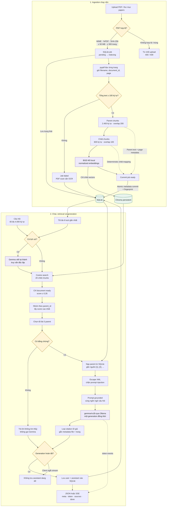

# Simple Local RAG

Ứng dụng RAG hỏi đáp PDF chạy trên một máy local: Web UI, REST API, streaming
SSE, upload/xóa tài liệu, lịch sử nhiều lượt và citation đúng trang. PDF, câu hỏi,
embedding và câu trả lời không được gửi tới dịch vụ cloud.

Stack mặc định:

- `BAAI/bge-m3`: embedding local, chỉ đọc từ Hugging Face cache khi chạy.
- `gemma4:e2b`: sinh câu trả lời bằng Ollama tại `127.0.0.1:11434`.
- Chroma: vector index bền vững trên ổ đĩa.
- SQLite: tài liệu, parent chunks, child mapping, job và lịch sử chat.
- FastAPI + HTML/CSS/JavaScript thuần; không dùng CDN hoặc Node.

## Kiến trúc



Parent và child không bao giờ vượt ranh giới trang. ID tài liệu/chunk được tạo xác
định từ SHA-256, số trang và vị trí chunk; retry không tạo bản trùng.

## 1. Yêu cầu hệ thống

- macOS/Linux, khuyến nghị RAM 16 GB.
- Python 3.11–3.13.
- Ollama.
- Khoảng 12–15 GB trống cho Gemma 4, BGE-M3 và index.

Trên macOS có thể cài bằng Homebrew:

```bash
brew install python@3.13 ollama
brew services start ollama
```

## 2. Tạo môi trường và cài dependency

```bash
cd /Users/thachtan/Documents/source/APG/SimpleRAGChatBot
python3 -m venv .venv
source .venv/bin/activate
python -m pip install --upgrade pip
python -m pip install ".[test]"
```

Project không dùng `langchain-community`, FAISS, `unstructured`, OpenAI API hay
LangSmith tracing.

## 3. Tải model một lần khi có Internet

Tải Gemma 4 vào Ollama:

```bash
ollama pull gemma4:e2b
ollama run gemma4:e2b "Trả lời đúng một từ: OK"
```

Tải BGE-M3 vào Hugging Face cache:

```bash
HF_HUB_OFFLINE=0 TRANSFORMERS_OFFLINE=0 python -c \
  'from sentence_transformers import SentenceTransformer; SentenceTransformer("BAAI/bge-m3"); print("BGE-M3 ready")'
```

Cảnh báo về request chưa xác thực tới Hugging Face ở bước này chỉ liên quan đến
việc tải model public; PDF không được upload. Khi ứng dụng chạy, các biến
`HF_HUB_OFFLINE=1`, `TRANSFORMERS_OFFLINE=1`, `HF_HUB_DISABLE_TELEMETRY=1` và
`LANGSMITH_TRACING=false` được bật mặc định.

## 4. Chạy Web UI và API

```bash
brew services start ollama
source .venv/bin/activate
python chatbot.py serve
```

Mở <http://127.0.0.1:8000>. Server chỉ bind `127.0.0.1`; phiên bản này không có
authentication và không nên bind ra LAN/Internet.

Lần khởi động đầu tiên, các PDF có sẵn trong `papers/` được copy và đưa vào hàng
đợi một cách idempotent. UI tự cập nhật trạng thái:

```text
pending -> indexing -> ready
                     -> failed
```

PDF có dưới 100 ký tự text được đánh dấu `failed` vì bản này chưa có OCR.

Kiểm tra sức khỏe:

```bash
curl http://127.0.0.1:8000/api/health
```

`status=degraded` thường có nghĩa Ollama chưa chạy hoặc thiếu `gemma4:e2b`; việc
quản lý/index tài liệu vẫn hoạt động.

## 5. CLI

`chatbot.py` vẫn tương thích cách chạy cũ:

```bash
python chatbot.py
```

Trong CLI, dùng `/new` để tạo phiên mới và `/quit` để thoát.

Import/index một file hoặc cả thư mục rồi chờ job hoàn tất:

```bash
python chatbot.py ingest papers
python chatbot.py ingest /duong/dan/tai_lieu.pdf
```

Chạy bộ eval 20 câu local:

```bash
python chatbot.py evaluate evals/questions.jsonl
```

Eval báo `parent_recall_at_5`, citation đúng trang, abstention và số citation
không liên quan. Ngưỡng nghiệm thu được ghi ngay trong kết quả JSON.
Bản baseline đã chạy trên toàn bộ hai PDF mẫu nằm tại `evals/baseline.json`;
ground truth trang tương ứng nằm trong `evals/questions.jsonl`.

## REST API

| Method | Endpoint | Mục đích |
| --- | --- | --- |
| `GET` | `/api/health` | SQLite, Chroma, Ollama và số child đã index |
| `GET` | `/api/documents` | Danh sách tài liệu/job |
| `POST` | `/api/documents` | Upload multipart PDF; trả `202` |
| `GET` | `/api/documents/{id}` | Xem trạng thái một tài liệu |
| `DELETE` | `/api/documents/{id}` | Xóa vector, metadata và file; `204` |
| `POST` | `/api/chat` | Trả JSON hoàn chỉnh |
| `POST` | `/api/chat/stream` | Trả SSE `meta`, `token`, `sources`, `done`, `error` |
| `GET` | `/api/sessions/{id}/messages` | Đọc lịch sử local |
| `DELETE` | `/api/sessions/{id}` | Xóa một hội thoại |

Upload bằng `curl`:

```bash
curl -F "file=@papers/research_paper_1_enterprise_rag.pdf;type=application/pdf" \
  http://127.0.0.1:8000/api/documents
```

Chat trên tất cả tài liệu `ready`:

```bash
curl -H "content-type: application/json" \
  -d '{"question":"Enterprise RAG nên được đánh giá như thế nào?"}' \
  http://127.0.0.1:8000/api/chat
```

Giới hạn phạm vi tìm kiếm và tiếp tục một hội thoại:

```json
{
  "question": "Điểm yếu chính của phương pháp đó là gì?",
  "session_id": "ID-nhan-tu-lan-truoc",
  "document_ids": ["doc_..."]
}
```

Câu hỏi tối đa 4.000 ký tự. Mỗi session giữ tối đa 100 message; query rewrite chỉ
dùng 6 lượt gần nhất. Chỉ một generation chạy tại một thời điểm để phù hợp máy
16 GB. Nếu client ngắt SSE trước khi sinh xong, assistant message dở dang không
được lưu.

## Cấu hình `RAG_*`

Ứng dụng chỉ đọc biến môi trường; nó không tự tải `.env` và không đọc
`OPENAI_API_KEY`. Có thể copy tên biến từ `.env.example` rồi export trong shell.

| Biến | Mặc định |
| --- | --- |
| `RAG_BASE_DIR` | thư mục terminal hiện tại; `chatbot.py` dùng thư mục chứa file |
| `RAG_DATA_DIR` | `./data` |
| `RAG_PAPERS_DIR` | `./papers` |
| `RAG_EMBEDDING_MODEL` | `BAAI/bge-m3` |
| `RAG_CHAT_MODEL` | `gemma4:e2b` |
| `RAG_OLLAMA_BASE_URL` | `http://127.0.0.1:11434` |
| `RAG_PARENT_CHUNK_SIZE` / `OVERLAP` | `2400` / `200` |
| `RAG_CHILD_CHUNK_SIZE` / `OVERLAP` | `600` / `100` |
| `RAG_CHILD_SEARCH_K` | `20` |
| `RAG_PARENT_SEARCH_K` | `5` |
| `RAG_RELEVANCE_THRESHOLD` | `0.35` |
| `RAG_MAX_UPLOAD_BYTES` | `52428800` |
| `RAG_MAX_PDF_PAGES` | `300` |
| `RAG_ANSWER_NUM_PREDICT` | `800` |
| `RAG_REWRITE_NUM_PREDICT` | `96` |

Embedding model và thông số chunk tạo thành index fingerprint. Khi chúng thay
đổi, tài liệu `ready` được tự động đưa về hàng đợi và reindex vào collection mới.

## Dữ liệu và backup

```text
data/
├── rag.sqlite3       # metadata, job, parent chunks, hội thoại
├── chroma/           # child vectors persistent
├── uploads/          # bản PDF do ứng dụng quản lý
└── logs/rag.jsonl    # structured metadata log, không có nội dung riêng tư
```

Để có snapshot nhất quán, dừng server bằng `Ctrl+C`, sau đó copy nguyên thư mục:

```bash
cp -a data "data-backup-$(date +%Y%m%d-%H%M%S)"
```

Khôi phục bằng cách dừng server và thay toàn bộ `data/` bằng cùng một snapshot;
không trộn SQLite của snapshot này với Chroma của snapshot khác.

Structured log chỉ ghi event, request ID, thời gian, document/chunk ID, score và
loại lỗi. Nội dung PDF, câu hỏi và câu trả lời không được ghi log mặc định.

## Kiểm thử

```bash
source .venv/bin/activate
python -m pytest
```

Smoke test với model và PDF thật (sẽ in câu hỏi/câu trả lời ra terminal, nhưng
không ghi chúng vào structured log):

```bash
python -m scripts.smoke
```

Test hiện bao phủ:

- chunk theo trang, ID xác định, SHA duplicate và validation PDF/tên file;
- SQLite restart/job recovery/history pruning;
- Chroma restart không embedding lại và delete vector;
- relevance threshold, parent grouping, query rewrite và citation formatter;
- path traversal, HTML/XML trong PDF, prompt injection và citation ID giả;
- upload/status/delete/chat/SSE/health bằng FastAPI `TestClient`;
- đóng stream không lưu assistant message thiếu.

## Chạy offline hoàn toàn

Sau khi hai model đã cache:

1. Khởi động Ollama và ứng dụng.
2. Đợi tài liệu chuyển sang `ready`.
3. Ngắt Wi-Fi/Internet.
4. Hỏi lại qua Web UI hoặc CLI.

Nếu BGE-M3 không có trong cache, startup sẽ dừng thay vì âm thầm tải mạng. Gemma
chỉ được gọi qua địa chỉ Ollama local.

## Lỗi thường gặp

### `model 'gemma4:e2b' not found`

```bash
ollama pull gemma4:e2b
ollama list
```

### Không kết nối được Ollama

```bash
brew services restart ollama
curl http://127.0.0.1:11434/api/tags
```

### Không tìm thấy BGE-M3 trong cache

Kết nối Internet và chạy lại lệnh tải BGE-M3 ở bước 3, sau đó khởi động lại app.

### PDF `failed` vì scan

Phiên bản này chỉ đọc text layer bằng `pypdf`. Hãy OCR PDF trước khi upload; app
không tự OCR ảnh.

### Đổi cấu hình nhưng đang reindex lâu

Đây là hành vi mong đợi của fingerprint. Chat vẫn dùng các tài liệu đã commit
`ready`; tài liệu đang `indexing` chưa tham gia retrieval.

## Tài liệu tham khảo

- [Chroma integration trong LangChain](https://docs.langchain.com/oss/python/integrations/vectorstores/chroma)
- [FastAPI UploadFile](https://fastapi.tiangolo.com/tutorial/request-files/)
- [FastAPI testing](https://fastapi.tiangolo.com/tutorial/testing/)
- [Gemma 4 trên Ollama](https://ollama.com/library/gemma4)
- [BAAI/bge-m3](https://huggingface.co/BAAI/bge-m3)
